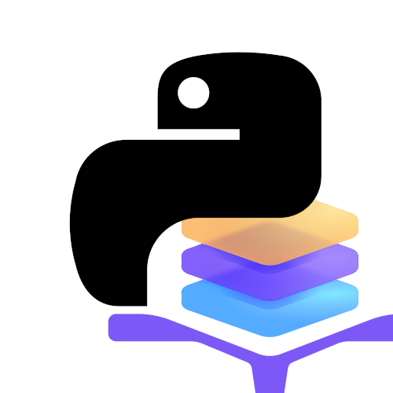

# Taikun Python Client
Taikun Python Client is a repository containing all the nescassary things to get started developing with Taikun Python client.


|   | ⚠ Taikun Py Client is still in early alpha stages of development. <br/> Both Client and Generated backend can, and probably will change. |
|---|------------------------------------------------------------------------------------------------------------------------------------------|


## What is this? 
The repository is divided into 3 folders
- taikunpy 
  - Client wrapper taking care of authentication (bare bones alpha)
- taikunpycore
  - Python client for CloudWorks API, generated using OpenAPI generator
- example-project
  - Simple project showcasing some basic API calls using the taikunpy client.

## Installation
Create and activate a new python virtual enviroment.
```bash
python3 -m venv .venv-taikunpy
source .venv-taikunpy/bin/activate
```

Install the **taikunpycore** package. (all the api calls and dtos)
```bash
pip install taikunpycore/ -r taikunpycore/requirements.txt
```

Install the **taikunpy** package. (the login wrapper)
```bash
pip install taikunpy/ -r taikunpy/requirements.txt
```

The TaikunPy client uses environment variables to authenticate to Taikun CloudWorks. 
```bash
export TAIKUN_EMAIL="john.doe@company.com"
export TAIKUN_PASSWORD="mYeTQWKQA485FXifOr8vWWg3m2"
```

Run the example project.
```bash
python example-project/main.py 
```

By default, it will just print out the name of logged-in user.
If all was successful you should see: 
```bash
$ python example-project/main.py 
User Info: johndoe
```

### Working with endpoints
TaikunPy Core shows you many endpoints you are able to call to control CloudWorks.
Some of the things you can control are
- VMs, servers
- k8s clusters
- k8s cluster resources
- applications
- and much more...


You can **explore the available capabilities** in the following ways:
- The complete list of Endpoints and their documentation is available in the [taikuncore README](./taikunpycore/README.md)
- A web based swagger to test API call is available at [this link](https://api.taikun.cloud/swagger/index.html).


### Additional login environment variables
The default API host is `api.taikun.cloud`.
To override it, set the following environment variable. Set it **without** `https://`
```
export TAIKUN_API_HOST=api.custom.cloud (default value is: api.taikun.cloud)
```

To authenticate with Keycloak, set the following environment variables:
```
TAIKUN_KEYCLOAK_EMAIL
TAIKUN_KEYCLOAK_PASSWORD
```

## Missing key features
- [ ] Showback
- [ ] Round trip to get new authentication token.
- [ ] Proper error handling
- [ ] Only some fields should be nullable - now all are
- [ ] Many more....

## Authors
Radek Smid, OpenAPI generator, gpt-4o.

MIT license
